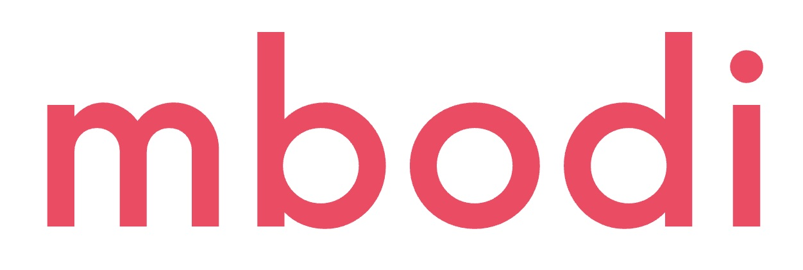

# Mbodied Agents



[](https://opensource.org/licenses/Apache-2.0)
[](https://github.com/MbodiAI/opensource/actions/workflows/macos.yml)
[](https://github.com/MbodiAI/opensource/actions/workflows/ubuntu.yml)
[](https://pypi.python.org/pypi/mbodied-agents)
[](https://colab.research.google.com/drive/1DAQkuuEYj8demiuJS1_10FIyTI78Yzh4?usp=sharing)

## Updates

**June 2, 2024**

mbodied-agents v0.0.5: Fixed PyPI project dependency. Added dataset Replayer. Updated README.

##

Welcome to **Mbodied Agents**, a toolkit for integrating various state-of-the-art transformers into robotics stacks. Mbodied Agents is designed to provide a consistent interface for calling different AI models, handling multimodal data, using/creating datasets trained on different robots, and work for arbitrary observation and action spaces. See [Getting Started](#getting-started).


Each time you interact with a robot, the data is automatically recorded into a dataset, which can be augmented and used for model training. We are actively developing tools for processing the dataset, augmenting the data, and finetuning foundation models. If you'd like to learn more or provide feedback, please fill out this [form](https://forms.gle/rv5rovK93dLucma37).◊


We welcome any questions, issues, or PRs!

Please join our [Discord](https://discord.gg/RNzf3RCxRJ) for interesting discussions! **⭐ Give us a star on GitHub if you like us!**

- [Mbodied Agents](#mbodied-agents)
  - [What is Mbodied Agents for](#what-is-mbodied-agents-for)
  - [Overview](#overview)
    - [Support Matrix](#support-matrix)
    - [In Beta](#in-beta)
    - [Idea](#idea)
  - [Installation](#installation)
  - [Dev Environment Setup](#dev-environment-setup)
  - [Getting Started](#getting-started)
  - [Glossary](#glossary)
  - [Building Blocks](#building-blocks)
    - [The Sample class](#the-sample-class)
    - [Message](#message)
    - [Backend](#backend)
    - [Cognitive Agent](#cognitive-agent)
    - [Controls](#controls)
    - [Hardware Interface](#hardware-interface)
    - [Recorder](#recorder)
  - [Directory Structure](#directory-structure)
  - [Contributing](#contributing)

## What is Mbodied Agents for

Mbodied Agents simplifies the integration of advanced AI models in robotics. It offers a unified platform for controlling various robots using state-of-the-art transformers and multimodal data processing. This toolkit enables experimentation with AI models, dataset collection and augmentation, and model training or finetuning for specific tasks. The goal is to develop intelligent, adaptable robots that learn from interactions and perform complex tasks in dynamic environments.

## Overview

Mbodied Agents offers the following features:

- **Configurability** : Define your desired Observation and Action spaces and read data into the format that works best for your system.
- **Natural Language Control** : Use verbal prompts to correct a cognitive agent's actions and calibrate its behavior to a new environment.
- **Modularity** : Easily swap out different backends, transformers, and hardware interfaces. For even better results, run multiple agents in separate threads.
- **Validation** : Ensure that your data is in the correct format and that your actions are within the correct bounds before sending them to the robot.

### Support Matrix

If you would like to integrate a new backend, sense, or motion control, it is very easy to do so. Please refer to the [contributing guide](CONTRIBUTING.md) for more information.

- OpenAI
- Anthropic
- Mbodi (Coming Soon)
- HuggingFace (Coming Soon)
- Gemini (Coming Soon)

### In Beta

For access (or just to say hey 😊), don't hesitate to fill out this [form](https://forms.gle/rv5rovK93dLucma37) or reach out to us at <info@mbodi.ai>.

- **Conductor**: A service for processing and managing datasets, and automatically training your models on your own data.
- **Conductor Dashboard**: See how GPT-4o, Claude Opus, or your custom models are performing on your datasets and open benchmarks.
- **Data Augmentation**: Build invariance to different environments by augmenting your dataset with Mbodi's diffusion-based data augmentation to achieve better generalization.
- **Mbodied SVLM**: A new Spatial Vision Language Model trained specifically for spatial reasoning and robotics control.

### Idea

The core idea behind Mbodied Agents is end-to-end continual learning. We believe that the best way to train a robot is to have it learn from its own experiences.

## Installation

`pip install mbodied-agents`

## Dev Environment Setup

1. Clone this repo:

   ```console
   git clone https://github.com/MbodiAI/mbodied-agents.git
   ```

2. Install system dependencies:

   ```console
   source install.bash
   ```

3. Then for each new terminal, run:

   ```console
   hatch shell
   ```

## Getting Started

### SimplerEnv Simulation

Run an OpenAI based Cognitive Agent in action within a SimplerEnv simulation, that is prompt-tuned to output observations and actions in the form of X, Y, Z coordinates, roll, pitch, yaw, and grasp actions.

Click the following Colab link to get started:

[](https://colab.research.google.com/drive/1sZtVLv17g9Lin1O2DyecBItWXwzUVUeH)

### Real Robot Hardware
To run the Cognitive Agent on real robot hardware, refer to our in-depth tutorial provided in the Colab link below:

[](https://colab.research.google.com/drive/1DAQkuuEYj8demiuJS1_10FIyTI78Yzh4?usp=sharing)

Alternatively, you can also run [examples/simple_robot_agent.py](examples/simple_robot_agent.py)

To run `simple_robot_agent.py`, if you want to use OpenAI, for example, as your backend:

```shell
export OPENAI_API_KEY=your_api_key
python examples/simple_robot_agent.py --backend=openai
```


To learn more about **SimplerEnv**, visit

[](https://github.com/simpler-env/SimplerEnv.git)


## Glossary

- **Agent**: A unit of intelligent computation that takes in an `Observation` and outputs an `Action`. This can involve multiple sub-agents.

- **Backend**: The system that embodied agents query. This typically involves a vision-language model or other specially purposed models.

- **Control**: An atomic action that is “handed off” to other processes outside the scope of consideration. An example is HandControl, which includes x, y, z, roll, pitch, yaw, and grasp. This is a motion control used to manage the position, orientation, and hand-openness of an end-effector. Typically, this is passed to lower-level hardware interfaces or libraries.

- **Simulation**: A SimplerEnv environment that takes the `Action` from the **Control** and applies it to a robot over a specified number of timesteps, demonstrating the simulation. It can also be used to benchmark the accuracy of your agents (models) within a simulation environment.

## Building Blocks

### The [Sample](src/mbodied_agents/base/sample.py) class

The Sample class is a base model for serializing, recording, and manipulating arbitrary data. It is designed to be extensible, flexible, and strongly typed. By wrapping your observation or action objects in the [Sample](src/mbodied_agents/base/sample.py) class, you'll be able to convert to and from the following with ease:

- a Gym space for creating a new Gym environment
- a flattened list, array, or tensor for plugging into an ML model
- a HuggingFace dataset with semantic search capabilities
- a Pydantic BaseModel for reliable and quick json serialization/deserialization.

#### Creating a Sample

Here is an example of creating a Sample and using its methods:

```python
# Creating a Sample instance
sample = Sample(observation=[1,2,3], action=[4,5,6])

# Flattening the Sample instance
flat_list = sample.flatten()
print(flat_list) # Output: [1, 2, 3, 4, 5, 6]

# Generating a simplified JSON schema
schema = sample.schema()
print(schema)
# Output: {'type': 'object', 'properties': {'observation': {'type': 'array', 'items': {'type': 'integer'}}, 'action': {'type': 'array', 'items': {'type': 'integer'}}}}

# Unflattening a list into a Sample instance
unflattened_sample = Sample.unflatten(flat_list, schema)
print(unflattened_sample) # Output: Sample(observation=[1, 2, 3], action=[4, 5, 6])
```

#### Serialization and Deserialization with Pydantic

The Sample class leverages Pydantic's powerful features for serialization and deserialization, allowing you to easily convert between Sample instances and JSON.

To serialize or deserialize a Sample instance with JSON:

```python
# Serialize the Sample instance to JSON
sample = Sample(observation=[1,2,3], action=[4,5,6])
json_data = sample.model_dump_json()
print(json_data) # Output: '{"observation": [1, 2, 3], "action": [4, 5, 6]}'

# Deserialize the JSON data back into a Sample instance
json_data = '{"observation": [1, 2, 3], "action": [4, 5, 6]}'
sample = Sample.model_validate(from_json(json_data))
print(sample) # Output: Sample(observation=[1, 2, 3], action=[4, 5, 6])
```

#### Converting to Different Containers

```python
# Converting to a dictionary
sample_dict = sample.to("dict")
print(sample_dict) # Output: {'observation': [1, 2, 3], 'action': [4, 5, 6]}

# Converting to a NumPy array
sample_np = sample.to("np")
print(sample_np) # Output: array([1, 2, 3, 4, 5, 6])

# Converting to a PyTorch tensor
sample_pt = sample.to("pt")
print(sample_pt) # Output: tensor([1, 2, 3, 4, 5, 6])

# Converting to a HuggingFace Dataset
sample_hf = sample.to("hf")
print(sample_hf)
# Output: Dataset({
#     features: ['observation', 'action'],
#     num_rows: 3
# })
```

#### Gym Space Integration

```python
# Creating a Gym space from the Sample instance
gym_space = sample.space()
print(gym_space)
# Output: Dict('action': Box(-inf, inf, (3,), float64), 'observation': Box(-inf, inf, (3,), float64))
```

See [sample.py](src/mbodied_agents/base/sample.py) for more details.

### Message

The [Message](src/mbodied_agents/types/message.py) class represents a single completion sample space. It can be text, image, a list of text/images, Sample, or other modality. The Message class is designed to handle various types of content and supports different roles such as user, assistant, or system.

You can create a `Message` in versatile ways. They can all be understood by mbodi's backend.

```python
Message(role="user", content="example text")
Message(role="user", content=["example text", Image("example.jpg"), Image("example2.jpg")])
Message(role="user", content=[Sample("Hello")])
```

### Backend

The [Backend](src/mbodied_agents/base/backend.py) class is an abstract base class for Backend implementations. It provides the basic structure and methods required for interacting with different backend services, such as API calls for generating completions based on given messages. See [backend directory](src/mbodied_agents/agents/backends) on how various backends are implemented.

### Cognitive Agent

The [Cognitive Agent](src/mbodied_agents/agents/language/cognitive_agent.py) is the main entry point for intelligent robot agents. It can connect to different backends or transformers of your choice. It includes methods for recording conversations, managing context, looking up messages, forgetting messages, storing context, and acting based on an instruction and an image.

Currently supported API services are OpenAI and Anthropic. Upcoming API services include Mbodi, Ollama, and HuggingFace. Stay tuned for our Mbodi backend service!

For example, to use OpenAI for your robot backend:

```python
robot_agent = CognitiveAgent(context=context_prompt, api_service="openai")
```

`context` can be either a string or a list, for example:

```python
context_prompt = "you are a robot"
# OR
context_prompt = [
    Message(role="system", content="you are a robot"),
    Message(role="user", content=["example text", Image("example.jpg")]),
    Message(role="assistant", content="Understood."),
]
```

To execute an instruction:

```python
response = robot_agent.act(instruction, image)[0]
# You can also pass an arbituary number of text and image to the agent:
response = robot_agent.act([instruction1, image1, instruction2, image2])[0]
```

### Controls

The [controls](src/mbodied_agents/types/controls.py) module defines various motions to control a robot as Pydantic models. They are also subclassed from `Sample`, thus possessing all the capability of `Sample` as mentioned above. These controls cover a range of actions, from simple joint movements to complex poses and full robot control.

### Hardware Interface

Mapping robot actions from any model to any embodiment is very easy. In our example script, we use a mock hardware interface. We also have an [XArm interface](src/mbodied_agents/hardware/xarm_interface.py) as an example.

Upcoming: a remote hardware interface with a communication protocol. This will be very convenient for controlling robots that have a computer attached, e.g., LoCoBot.

### Recorder

Dataset [Recorder](src/mbodied_agents/data/recording.py) can record your conversation and the robot's actions to a dataset as you interact with/teach the robot. You can define any observation space and action space for the Recorder.

Here's an example of recording observation, instruction, and the output HandControl (x, y, z, r, p, y, grasp).

```python
observation_space = spaces.Dict({
    'image': Image(size=(224, 224)).space(),
    'instruction': spaces.Text(1000)
})
action_space = HandControl().space()
recorder = Recorder('example_recorder', out_dir='saved_datasets', observation_space=observation_space, action_space=action_space)

# Every time robot makes a conversation or performs an action:
recorder.record(observation={'image': image, 'instruction': instruction,}, action=hand_control)
```

The dataset is saved to `./saved_datasets`. Learn more about augmenting, and finetuning with this dataset by filling out this [form](https://forms.gle/rv5rovK93dLucma37).

### Dataset Replayer

The [Replayer](src/mbodied_agents/data/replaying.py) class is designed to process and manage data stored in HDF5 files generated by `Recorder`. It provides a variety of functionalities, including reading samples, generating statistics, extracting unique items, and converting datasets for use with HuggingFace. The Replayer also supports saving specific images during processing and offers a command-line interface for various operations.

Here's a simple example on iterating through a dataset from Recorder with Replayer:

```python
replayer = Replayer(path=str("path/to/dataset.h5"))
for observation, action in replayer:
   ...
```

## Directory Structure

```shell
├─ assets/ ............. Images, icons, and other static assets
├─ examples/ ........... Example scripts and usage demonstrations
├─ resources/ .......... Additional resources for examples
├─ src/
│  └─ mbodied/
│     ├─ agents/ ....... Modules for robot agents
│     │  ├─ backends/ .. Backend implementations for different services for agents
│     │  ├─ language/ .. Language based agents modules
│     │  └─ sense/ ..... Sensory, e.g. audio, processing modules
│     ├─ base/ ......... Base classes and core infra modules
│     ├─ data/ ......... Data handling and processing
│     ├─ hardware/ ..... Hardware interface and interaction
│     └─ types/ ........ Common types and definitions
└─ tests/ .............. Unit tests
```

## Contributing

We believe in the power of collaboration and open-source development. This platform is designed to be shared, extended, and improved by the community. See the [contributing guide](CONTRIBUTING.md) for more information.

Feel free to report any issues, ask questions, ask for features, or submit PRs.
