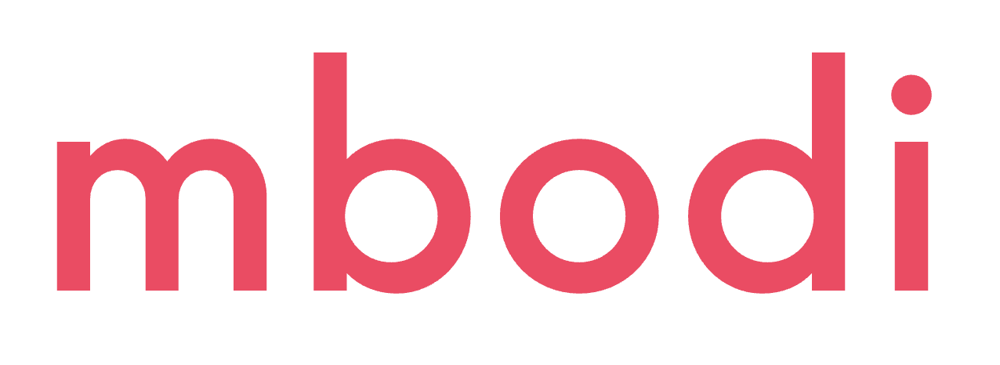

<div align="left">
 
  <div>&nbsp;</div>
  <div align="left">
    <sup>
      <a href="https://api.mbodi.ai">
        <i><font size="4">Benchmark, Explore, and Send API Requests Now</font></i>
      </a>
    </sup>
  </div>
  <div>&nbsp;</div>

[](https://opensource.org/licenses/Apache-2.0)
[](https://pypi.org/project/mbodied/)
[](https://pypi.org/project/mbodied)
[](https://pepy.tech/project/mbodied)
[](https://github.com/mbodiai/opensource/actions/workflows/macos.yml)
[](https://github.com/mbodiai/opensource/actions/workflows/ubuntu.yml)

📖 **Docs**: [docs](https://api.mbodi.ai/docs)

🚀 **Simple Robot Agent Example:** [](https://colab.research.google.com/drive/1KN0JohcjHX42wABBHe-CxXP-NWJjbZts?usp=sharing) </br>
💻 **Simulation Example with [SimplerEnv](https://github.com/simpler-env/SimplerEnv):** [](https://colab.research.google.com/drive/18oiuw1yTxO5x-eT7Z8qNyWtjyYd8cECI?usp=sharing) </br>
🤖 **Motor Agent using OpenVLA:** [](https://colab.research.google.com/drive/1flnMrqyepGOO8J9rE6rehzaLdZPsw6lX?usp=sharing)</br>
⏺️ **Record Dataset on a Robot**[](https://colab.research.google.com/drive/15UuFbMUJGEjqJ_7I_b5EvKvLCKnAc8bB?usp=sharing)</br>

🫡 **Support, Discussion, and How-To's** **:** </br>
[](https://discord.gg/BPQ7FEGxNb)

</div>

**Updates:**

**Aug 28 2024, embodied-agents v1.2**

- New [Doc site](https://api.mbodi.ai/docs) is up!
- Added the features to record dataset on [robot](mbodied/robots/robot.py) natively.
- Add multiple new Sensory Agents, i.e. [depth estimation](mbodied/agents/sense/depth_estimation_agent.py), [object detection](mbodied/agents/sense/object_detection_agent.py), [image segmentation](mbodied/agents/sense/segmentation_agent.py) with public [API endpoints](https://api.mbodi.ai/sense/) hosted. And a simple cli `mbodied` for trying them.
- Added [Auto Agent](mbodied/agents/auto/auto_agent.py) for dynamic agents selection.

**June 30 2024, embodied-agents v1.0**:

- Added Motor Agent supporting OpenVLA with free [API endpoint](https://api.mbodi.ai/community-models) hosted.
- Added Sensory Agent supporting i.e. 3D object pose detection.
- Improved automatic dataset recording.
- Agent now can make remote act calls to API servers i.e. Gradio, vLLM.
- Bug fixes and performance improvements have been made.
- PyPI project is renamed to `mbodied`.

# embodied agents

**embodied agents** is a toolkit for integrating large multi-modal models into existing robot stacks with just a few lines of code. It provides consistency, reliability, scalability and is configurable to any observation and action space.


- [embodied agents](#embodied-agents)
  - [Overview](#overview)
    - [Motivation](#motivation)
    - [Goals](#goals)
    - [Limitations](#limitations)
    - [Scope](#scope)
    - [Features](#features)
    - [Endpoints](#endpoints)
    - [Support Matrix](#support-matrix)
    - [To Do](#to-do)
  - [Installation](#installation)
  - [Getting Started](#getting-started)
    - [Customize a Motion to fit a robot's action space.](#customize-a-motion-to-fit-a-robots-action-space)
    - [Run a robotics transformer model on a robot.](#run-a-robotics-transformer-model-on-a-robot)
    - [Notebooks](#notebooks)
  - [The Sample Class](#the-sample-class)
  - [API Reference](#api-reference)
  - [Directory Structure](#directory-structure)
  - [Contributing](#contributing)

## Overview

This repository is broken down into 3 main components: **Agents**, **Data**, and **Hardware**. Inspired by the efficiency of the central nervous system, each component is broken down into 3 meta-modalities: **Language**, **Motion**, and **Sense**. Each agent has an `act` method that can be overridden and satisfies:

- **Language Agents** always return a string.
- **Motor Agents** always return a `Motion`.
- **Sensory Agents** always return a `SensorReading`.

For convenience, we also provide **AutoAgent** which dynamically initializes the right agent for the specified task. See [API Reference](#auto-agent) below for more.

A call to `act` or `async_act` can perform local or remote inference synchronously or asynchronously. Remote execution can be performed with [Gradio](https://www.gradio.app/docs/python-client/introduction), [httpx](https://www.python-httpx.org/), or different LLM clients. Validation is performed with [Pydantic](https://docs.pydantic.dev/latest/).


- Language Agents natively support OpenAI, Anthropic, Gemini, Ollama, vLLM, Gradio, etc
- Motor Agents natively support OpenVLA, RT1(upcoming)
- Sensory Agents support Depth Anything, YOLO, Segment Anything 2

Jump to [getting started](#getting-started) to get up and running on [real hardware](https://colab.research.google.com/drive/1KN0JohcjHX42wABBHe-CxXP-NWJjbZts?usp=sharing) or [simulation](https://colab.research.google.com/drive/1gJlfEvsODZWGn3rK8Nx4A0kLnLzJtJG_?usp=sharing). Be sure to join our [Discord](https://discord.gg/BPQ7FEGxNb) for 🥇-winning discussions :)

**⭐ Give us a star on GitHub if you like us!**

### Motivation

<details>
<summary>There is a signifcant barrier to entry for running SOTA models in robotics</summary>

It is currently unrealistic to run state-of-the-art AI models on edge devices for responsive, real-time applications. Furthermore,
the complexity of integrating multiple models across different modalities is a significant barrier to entry for many researchers,
hobbyists, and developers. This library aims to address these challenges by providing a simple, extensible, and efficient way to
integrate large models into existing robot stacks.

</details>

### Goals

<details>
<summary>Facillitate data-collection and sharing among roboticists.</summary>

This requires reducing much of the complexities involved with setting up inference endpoints, converting between different model formats, and collecting and storing new datasets for future availibility.

We aim to achieve this by:

1. Providing simple, Python-first abstrations that are modular, extensible and applicable to a wide range of tasks.
2. Providing endpoints, weights, and interactive Gradio playgrounds for easy access to state-of-the-art models.
3. Ensuring that this library is observation and action-space agnostic, allowing it to be used with any robot stack.

Beyond just improved robustness and consistency, this architecture makes asynchronous and remote agent execution exceedingly simple. In particular we demonstrate how responsive natural language interactions can be achieved in under 30 lines of Python code.

</details>

### Limitations

_Embodied Agents are not yet capable of learning from in-context experience_:

- Frameworks for advanced RAG techniques are clumsy at best for OOD embodied applications however that may improve.
- Amount of data required for fine-tuning is still prohibitively large and expensive to collect.
- Online RL is still in its infancy and not yet practical for most applications.

### Scope

- This library is intended to be used for research and prototyping.
- This library is still experimental and under active development. Breaking changes may occur although they will be avoided as much as possible. Feel free to report issues!

### Features

- Extensible, user-friendly python SDK with explicit typing and modularity
- Asynchronous and remote thread-safe agent execution for maximal responsiveness and scalability.
- Full-compatiblity with HuggingFace Spaces, Datasets, Gymnasium Spaces, Ollama, and any OpenAI-compatible api.
- Automatic dataset-recording and optionally uploads dataset to huggingface hub.

### Endpoints

- [OpenVLA](https://api.mbodi.ai/community-models/)
- [Sensory Tools](https://api.mbodi.ai/sense/)
- [Embodied AI Playground](https://api.mbodi.ai/benchmark/)

### Roadmap

- [x] OpenVLA Motor Agent
- [x] Automatic dataset recording on Robot
- [x] Yolo, SAM2, DepthAnything Sensory Agents
- [x] Auto Agent
- [x] Google Gemini Backend
- [ ] ROS integration
- [ ] More Motor Agents, i.e. RT1
- [ ] More device support, i.e. OpenCV camera
- [ ] Fine-tuning Scripts

## Installation

```shell
pip install mbodied

# With extra dependencies, i.e. torch, opencv-python, etc.
pip install mbodied[extras]

# For audio support
pip install mbodied[audio]
```

Or install from source:

```shell
pip install git+https://github.com/mbodiai/embodied-agents.git
```

## Getting Started

### Customize a Motion to fit a robot's action space.

```python
from mbodied.types.motion.control import HandControl, FullJointControl
from mbodied.types.motion import AbsoluteMotionField, RelativeMotionField

class FineGrainedHandControl(HandControl):
    comment: str = Field(None, description="A comment to voice aloud.")
    index: FullJointControl = AbsoluteMotionField([0,0,0],bounds=[-3.14, 3.14], shape=(3,))
    thumb: FullJointControl = RelativeMotionField([0,0,0],bounds=[-3.14, 3.14], shape=(3,))
```

### Run a robotics transformer model on a robot.

```python
import os
from mbodied.agents import LanguageAgent
from mbodied.agents.motion import OpenVlaAgent
from mbodied.agents.sense.audio import AudioAgent
from mbodied.robots import SimRobot

cognition = LanguageAgent(
  context="You are an embodied planner that responds with a python list of strings and nothing else.",
  api_key=os.getenv("OPENAI_API_KEY"),
  model_src="openai",
  recorder="auto",
)
audio = AudioAgent(use_pyaudio=False, api_key=os.getenv("OPENAI_API_KEY")) # pyaudio is buggy on mac
motion = OpenVlaAgent(model_src="https://api.mbodi.ai/community-models/")

# Subclass and override do() and capture() methods.
robot = SimRobot()

instruction = audio.listen()
plan = cognition.act(instruction, robot.capture())

for step in plan.strip('[]').strip().split(','):
  print("\nMotor agent is executing step: ", step, "\n")
  for _ in range(10):
    hand_control = motion.act(step, robot.capture())
    robot.do(hand_control)
```

Example Scripts:

- [1_simple_robot_agent.py](examples/1_simple_robot_agent.py): A very simple language based cognitive agent taking instruction from user and output voice and actions.
- [2_openvla_motor_agent_example.py](examples/2_openvla_motor_agent_example.py): Run robotic transformers, i.e. OpenVLA, in several lines on the robot.
- [3_reason_plan_act_robot.py](examples/3_reason_plan_act_robot.py): Full example of language based cognitive agent and OpenVLA motor agent executing task.
- [4_language_reason_plan_act_robot.py](examples/4_language_reason_plan_act_robot.py): Full example of all languaged based cognitive and motor agent executing task.
- [5_teach_robot_record_dataset.py](examples/5_teach_robot_record_dataset.py): Example of collecting dataset on robot's action at a specific frequency by just yelling at the robot!

### Notebooks

Real Robot Hardware: [](https://colab.research.google.com/drive/1KN0JohcjHX42wABBHe-CxXP-NWJjbZts?usp=sharing)

Simulation with: [SimplerEnv](https://github.com/simpler-env/SimplerEnv.git) : [](https://colab.research.google.com/drive/18oiuw1yTxO5x-eT7Z8qNyWtjyYd8cECI?usp=sharing)

Run OpenVLA with embodied-agents in simulation: [](https://colab.research.google.com/drive/1flnMrqyepGOO8J9rE6rehzaLdZPsw6lX?usp=sharing)

Record dataset on a robot: [](https://colab.research.google.com/drive/15UuFbMUJGEjqJ_7I_b5EvKvLCKnAc8bB?usp=sharing)

## The [Sample](mbodied/base/sample.py) Class

The Sample class is a base model for serializing, recording, and manipulating arbitrary data. It is designed to be extendable, flexible, and strongly typed. By wrapping your observation or action objects in the [Sample](mbodied/base/sample.py) class, you'll be able to convert to and from the following with ease:

- A Gym space for creating a new Gym environment.
- A flattened list, array, or tensor for plugging into an ML model.
- A HuggingFace dataset with semantic search capabilities.
- A Pydantic BaseModel for reliable and quick json serialization/deserialization.

To learn more about all of the possibilities with embodied agents, check out the [documentation](https://mbodi-ai-mbodied-agents.readthedocs-hosted.com/en/latest/)

### 💡 Did you know

- You can `pack` a list of `Sample`s or Dicts into a single `Sample` or `Dict` and `unpack` accordingly?
- You can `unflatten` any python structure into a `Sample` class so long you provide it with a valid json schema?

## API Reference

#### Creating a Sample

Creating a Sample requires just wrapping a python dictionary with the `Sample` class. Additionally, they can be made from kwargs, Gym Spaces, and Tensors to name a few.

```python
from mbodied.types.sample import Sample
# Creating a Sample instance
sample = Sample(observation=[1,2,3], action=[4,5,6])

# Flattening the Sample instance
flat_list = sample.flatten()
print(flat_list) # Output: [1, 2, 3, 4, 5, 6]

# Generating a simplified JSON schema
>>> schema = sample.schema()
{'type': 'object', 'properties': {'observation': {'type': 'array', 'items': {'type': 'integer'}}, 'action': {'type': 'array', 'items': {'type': 'integer'}}}}

# Unflattening a list into a Sample instance
Sample.unflatten(flat_list, schema)
>>> Sample(observation=[1, 2, 3], action=[4, 5, 6])
```

#### Serialization and Deserialization with Pydantic

The Sample class leverages Pydantic's powerful features for serialization and deserialization, allowing you to easily convert between Sample instances and JSON.

```python
# Serialize the Sample instance to JSON
sample = Sample(observation=[1,2,3], action=[4,5,6])
json_data = sample.model_dump_json()
print(json_data) # Output: '{"observation": [1, 2, 3], "action": [4, 5, 6]}'

# Deserialize the JSON data back into a Sample instance
json_data = '{"observation": [1, 2, 3], "action": [4, 5, 6]}'
sample = Sample.model_validate(from_json(json_data))
print(sample) # Output: Sample(observation=[1, 2, 3], action=[4, 5, 6])
```

#### Converting to Different Containers

```python
# Converting to a dictionary
sample_dict = sample.to("dict")
print(sample_dict) # Output: {'observation': [1, 2, 3], 'action': [4, 5, 6]}

# Converting to a NumPy array
sample_np = sample.to("np")
print(sample_np) # Output: array([1, 2, 3, 4, 5, 6])

# Converting to a PyTorch tensor
sample_pt = sample.to("pt")
print(sample_pt) # Output: tensor([1, 2, 3, 4, 5, 6])
```

#### Gym Space Integration

```python
gym_space = sample.space()
print(gym_space)
# Output: Dict('action': Box(-inf, inf, (3,), float64), 'observation': Box(-inf, inf, (3,), float64))
```

See [sample.py](mbodied/base/sample.py) for more details.

### Message

The [Message](mbodied/types/message.py) class represents a single completion sample space. It can be text, image, a list of text/images, Sample, or other modality. The Message class is designed to handle various types of content and supports different roles such as user, assistant, or system.

You can create a `Message` in versatile ways. They can all be understood by mbodi's backend.

```python
from mbodied.types.message import Message

Message(role="user", content="example text")
Message(role="user", content=["example text", Image("example.jpg"), Image("example2.jpg")])
Message(role="user", content=[Sample("Hello")])
```

### Backend

The [Backend](mbodied/base/backend.py) class is an abstract base class for Backend implementations. It provides the basic structure and methods required for interacting with different backend services, such as API calls for generating completions based on given messages. See [backend directory](mbodied/agents/backends) on how various backends are implemented.

### Agent

[Agent](mbodied/base/agent.py) is the base class for various agents listed below. It provides a template for creating agents that can talk to a remote backend/server and optionally record their actions and observations.

### Language Agent

The [Language Agent](mbodied/agents/language/language_agent.py) can connect to different backends or transformers of your choice. It includes methods for recording conversations, managing context, looking up messages, forgetting messages, storing context, and acting based on an instruction and an image.

Natively supports API services: OpenAI, Anthropic, Gemini vLLM, Ollama, HTTPX, or any gradio endpoints. More upcoming!

To use OpenAI for your robot backend:

```python
from mbodied.agents.language import LanguageAgent

agent = LanguageAgent(context="You are a robot agent.", model_src="openai")
```

To execute an instruction:

```python
instruction = "pick up the fork"
response = robot_agent.act(instruction, image)
```

Language Agent can connect to vLLM as well. For example, suppose you are running a vLLM server Mistral-7B on 1.2.3.4:1234. All you need to do is:

```python
agent = LanguageAgent(
    context=context,
    model_src="openai",
    model_kwargs={"api_key": "EMPTY", "base_url": "http://1.2.3.4:1234/v1"},
)
response = agent.act("Hello, how are you?", model="mistralai/Mistral-7B-Instruct-v0.3")
```

Example using Ollama:

```python
agent = LanguageAgent(
    context="You are a robot agent.", model_src="ollama",
    model_kwargs={"endpoint": "http://localhost:11434/api/chat"}
)
response = agent.act("Hello, how are you?", model="llama3.1")
```

### Motor Agent

[Motor Agent](mbodied/agents/motion/motor_agent.py) is similar to Language Agent but instead of returning a string, it always returns a `Motion`. Motor Agent is generally powered by robotic transformer models, i.e. OpenVLA, RT1, Octo, etc.
Some small model, like RT1, can run on edge devices. However, some, like OpenVLA, may be challenging to run without quantization. See [OpenVLA Agent](mbodied/agents/motion/openvla_agent.py) and an [example OpenVLA server](examples/servers/gradio_example_openvla.py)

### Sensory Agent

These agents interact with the environment to collect sensor data. They always return a `SensorReading`, which can be various forms of processed sensory input such as images, depth data, or audio signals.

Currently, we have:

- [depth estimation](mbodied/agents/sense/depth_estimation_agent.py)
- [object detection](mbodied/agents/sense/object_detection_agent.py)
- [image segmentation](mbodied/agents/sense/segmentation_agent.py)

agents that process robot's sensor information.

### Auto Agent

[Auto Agent](mbodied/agents/auto/auto_agent.py) dynamically selects and initializes the correct agent based on the task and model.

```python
from mbodied.agents.auto.auto_agent import AutoAgent

# This makes it a LanguageAgent
agent = AutoAgent(task="language", model_src="openai")
response = agent.act("What is the capital of France?")

# This makes it a motor agent: OpenVlaAgent
auto_agent = AutoAgent(task="motion-openvla", model_src="https://api.mbodi.ai/community-models/")
action = auto_agent.act("move hand forward", Image(size=(224, 224)))

# This makes it a sensory agent: DepthEstimationAgent
auto_agent = AutoAgent(task="sense-depth-estimation", model_src="https://api.mbodi.ai/sense/")
depth = auto_agent.act(image=Image(size=(224, 224)))
```

Alternatively, you can use `get_agent` method in [auto_agent](mbodied/agents/auto/auto_agent.py) as well.

```python
language_agent = get_agent(task="language", model_src="openai")
```

### Motions

The [motion_controls](mbodied/types/motion_controls.py) module defines various motions to control a robot as Pydantic models. They are also subclassed from `Sample`, thus possessing all the capability of `Sample` as mentioned above. These controls cover a range of actions, from simple joint movements to complex poses and full robot control.

### Robot

You can integrate your custom robot hardware by subclassing [Robot](mbodied/robot/robot.py) quite easily. You only need to implement `do()` function to perform actions (and some additional methods if you want to record dataset on the robot). In our examples, we use a [mock robot](mbodied/robot/sim_robot.py). We also have an [XArm robot](mbodied/robot/xarm_robot.py) as an example.

#### Recording a Dataset

Recording a dataset on a robot is very easy! All you need to do is implement the `get_observation()`, `get_state()`, and `prepare_action()` methods for your robot. After that, you can record a dataset on your robot anytime you want. See [examples/5_teach_robot_record_dataset.py](examples/5_teach_robot_record_dataset.py) and this colab: [](https://colab.research.google.com/drive/15UuFbMUJGEjqJ_7I_b5EvKvLCKnAc8bB?usp=sharing) for more details.

```python
from mbodied.robots import SimRobot
from mbodied.types.motion.control import HandControl, Pose

robot = SimRobot()
robot.init_recorder(frequency_hz=5)
with robot.record("pick up the fork"):
  motion = HandControl(pose=Pose(x=0.1, y=0.2, z=0.3, roll=0.1, pitch=0.2, yaw=0.3))
  robot.do(motion)
```

### Recorder

Dataset [Recorder](mbodied/data/recording.py) is a lower level recorder to record your conversation and the robot's actions to a dataset as you interact with/teach the robot. You can define any observation space and action space for the Recorder. See [gymnasium](https://github.com/Farama-Foundation/Gymnasium) for more details about spaces.

```python
from mbodied.data.recording import Recorder
from mbodied.types.motion.control import HandControl
from mbodied.types.sense.vision import Image
from gymnasium import spaces

observation_space = spaces.Dict({
    'image': Image(size=(224, 224)).space(),
    'instruction': spaces.Text(1000)
})
action_space = HandControl().space()
recorder = Recorder('example_recorder', out_dir='saved_datasets', observation_space=observation_space, action_space=action_space)

# Every time robot makes a conversation or performs an action:
recorder.record(observation={'image': image, 'instruction': instruction,}, action=hand_control)
```

The dataset is saved to `./saved_datasets`.

### Replayer

The [Replayer](mbodied/data/replaying.py) class is designed to process and manage data stored in HDF5 files generated by `Recorder`. It provides a variety of functionalities, including reading samples, generating statistics, extracting unique items, and converting datasets for use with HuggingFace. The Replayer also supports saving specific images during processing and offers a command-line interface for various operations.

Example for iterating through a dataset from Recorder with Replayer:

```python
from mbodied.data.replaying import Replayer

replayer = Replayer(path=str("path/to/dataset.h5"))
for observation, action in replayer:
   ...
```

## Directory Structure

```shell
├─ assets/ ............. Images, icons, and other static assets
├─ examples/ ........... Example scripts and usage demonstrations
├─ resources/ .......... Additional resources for examples
├─ src/
│  └─ mbodied/
│     ├─ agents/ ....... Modules for robot agents
│     │  ├─ backends/ .. Backend implementations for different services for agents
│     │  ├─ language/ .. Language based agents modules
│     │  ├─ motion/ .... Motion based agents modules
│     │  └─ sense/ ..... Sensory, e.g. audio, processing modules
│     ├─ data/ ......... Data handling and processing
│     ├─ hardware/ ..... Hardware modules, i.e. camera
│     ├─ robot/ ........ Robot interface and interaction
│     └─ types/ ........ Common types and definitions
└─ tests/ .............. Unit tests
```

## Contributing

We welcome issues, questions and PRs. See the [contributing guide](CONTRIBUTING.md) for more information.
