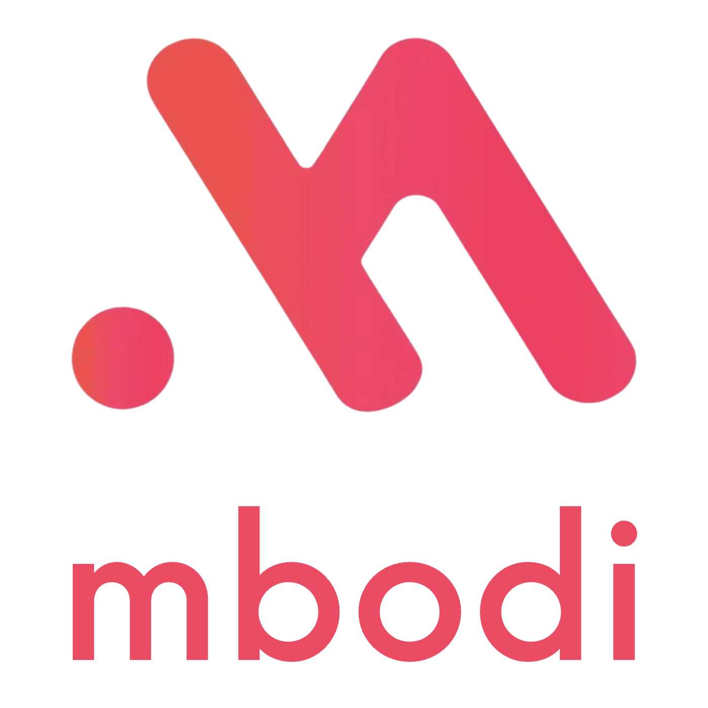

<div align="center">
 
  <div>&nbsp;</div>
  <div align="center">
    &nbsp;&nbsp;&nbsp;&nbsp;
    <b><font size="5"></font></b>
    <sup>
      <a href="https://api.mbodi.ai">
        <i><font size="4">Benchmark, Explore, and Send API Requests Now</font></i>
      </a>
    </sup>
  </div>
  <div>&nbsp;</div>

[](https://opensource.org/licenses/Apache-2.0)
[](https://pypi.org/project/mbodied/)
[](https://pypi.org/project/mbodied)
[](https://github.com/MbodiAI/opensource/actions/workflows/macos.yml)
[](https://github.com/MbodiAI/opensource/actions/workflows/ubuntu.yml)
[](https://readthedocs.com/projects/mbodi-ai-mbodied-agents/badge/?version=latest)

📖 **Docs**: [readthedocs](https://mbodi-ai-mbodied.readthedocs-hosted.com/en)

🚀 **Simple Robot Agent Example:** [](https://colab.research.google.com/drive/1qFoo2h4tD9LYtUwkWtO4XtVAwcKxALn_?usp=sharing) </br>
💻 **Simulation Example with [SimplerEnv](https://github.com/simpler-env/SimplerEnv):** [](https://colab.research.google.com/drive/1gJlfEvsODZWGn3rK8Nx4A0kLnLzJtJG_?usp=sharing) </br>
🤖 **Motor Agent using OpenVLA:** [](https://colab.research.google.com/drive/1anbOd4snFw84Zf0AvLrWReVdx61TfAIC?usp=sharing)

🫡 **Support, Discussion, and How-To's** **:** </br>
[](https://discord.gg/BPQ7FEGxNb)

</div>

# mbodied agents

**mbodied agents** is a toolkit for integrating large multi-modal models into existing robot stacks with just a few lines of code. It provides a consistent interface for calling different AI models, handling multimodal data, and is configurable to any observation and action space.


Jump to [getting started](#getting-started) to get up and running on [real hardware](https://colab.research.google.com/drive/1qFoo2h4tD9LYtUwkWtO4XtVAwcKxALn_?usp=sharing) or [simulation](https://colab.research.google.com/drive/1gJlfEvsODZWGn3rK8Nx4A0kLnLzJtJG_?usp=sharing). Be sure to join our [Discord](https://discord.gg/BPQ7FEGxNb) for 🥇-winning discussions :)

**⭐ Give us a star on GitHub if you like us!**

- [mbodied agents](#mbodied-agents)
  - [Overview](#overview)
  - [Installation](#installation)
  - [Getting Started](#getting-started)
  - [Building Blocks](#building-blocks)
  - [Directory Structure](#directory-structure)
  - [Contributing](#contributing)

## Overview


### Motivation

It is currently unrealistic to run state-of-the-art AI models on edge devices for responsive, real-time applications. Furthermore,
the complexity of integrating multiple models across different modalities is a significant barrier to entry for many researchers,
hobbyists, and developers. This library aims to address these challenges by providing a simple, extensible, and efficient way to
integrate large models into existing robot stacks.

### Goals

Facillitate data-collection and sharing among roboticists by reducing much of the complexities involved with setting up inference endpoints, converting between different model formats, and collecting and storing new datasets for future availibility.

We aim to achieve this by:

1. Providing simple, Python-first abstrations that are modular, extensible and applicable to a wide range of tasks.
2. Providing endpoints, weights, and interactive Gradio playgrounds for easy access to state-of-the-art models.
3. Ensuring that this library is observation and action-space agnostic, allowing it to be used with any robot stack.

Beyond just improved robustness and consistency, this architecture makes asynchronous and remote agent execution exceedingly simple. In particular we demonstrate how responsive natural language interactions can be achieved in under 10 lines of Python code.

### Scope

- This library is intended to be used for research and prototyping.
- This library is still experimental and under active development. Breaking changes may occur although they will be avoided as much as possible. Feel free to report issues!

### Limitations

_Agents are not yet capable of learning from experience_:

- Frameworks for advanced RAG techniques are clumsy at best for OOD embodied applications however that may improve.
- Amount of data required for fine-tuning is still prohibitively large and expensive to collect.
- Online RL is still in its infancy and not yet practical for most applications.

### Features

- User-friendly python SDK with explicit typing and modularity
- Asynchronous and remote thread-safe agent execution for maximal responsiveness and scalability.
- Full-compatiblity with HuggingFace Spaces, Datasets, Gymnasium Spaces, Ollama, and any OpenAI-compatible api.
- Automatic dataset-recording and optionally uploads dataset to huggingface hub.

### Example Use Case:

**Local Thread**

- Audio agent listens for a keyword.
- YOLO agent processes camera input and produces bounding boxes.
- Classical MPC module ensures commands don't violate constraints.

**API Services**

- Text-to-speech service further processes natural language input.
- GPU-accelerated 3D object pose detection
- GPT-4o for high-level plan generation

**Remote Thread**

- Custom proprietary model continually-learning through RLHF.

### Endpoints

- [OpenVLA](https://api.mbodi.ai/community-models/)
- [Embodied AI Playground](https://api.mbodi.ai/benchmark/)

### Support Matrix

- Open Weights: OpenVLA, Idefics2, Llava-1.6-Mistral, Phi-3-vision-128k-instruct
- Closed: OpenAI, Anthropic
- All gradio endpoints hosted on HuggingFace spaces.

### To Do

- [ ] More Motor Agents
- [ ] More Data Augmentation
- [ ] More Evaluation on Latency, Accuracy, and Prompting

## Installation

```shell
pip install mbodied
```

Optional Dependencies

```shell
pip install mbodied[extras]
```

## Getting Started

### Real Robot Hardware

Notebook Tutorial: [](https://colab.research.google.com/drive/1qFoo2h4tD9LYtUwkWtO4XtVAwcKxALn_?usp=sharing)

Script: [examples/simple_robot_agent.py](examples/simple_robot_agent.py)

```shell
export OPENAI_API_KEY=your_api_key
python examples/simple_robot_agent.py --backend=openai
```

### Simulation

Notebook Tutorial: [](https://colab.research.google.com/drive/1gJlfEvsODZWGn3rK8Nx4A0kLnLzJtJG_?usp=sharing)

To learn more about **SimplerEnv**, please visit [](https://github.com/simpler-env/SimplerEnv.git)

### Minimal Robotic Transformer Example using OpenVLA

Run OpenVLA as Motor Agent on robot in several lines: [examples/minimal_openvla_agent.py](examples/minimal_openvla_agent.py)

## Building Blocks

<details> <summary><h3 style="display: inline-block;">The Sample class</h3></summary>

The Sample class is a base model for serializing, recording, and manipulating arbitrary data. It is designed to be extendable, flexible, and strongly typed. By wrapping your observation or action objects in the [Sample](mbodied/base/sample.py) class, you'll be able to convert to and from the following with ease:

- A Gym space for creating a new Gym environment.
- A flattened list, array, or tensor for plugging into an ML model.
- A HuggingFace dataset with semantic search capabilities.
- A Pydantic BaseModel for reliable and quick json serialization/deserialization.

#### Creating a Sample

<details>
<summary>
Creating a Sample requires just wrapping a python dictionary with the `Sample` class. Additionally, they can be made from kwargs, Gym Spaces, and Tensors to name a few. </summary>

```python
# Creating a Sample instance
sample = Sample(observation=[1,2,3], action=[4,5,6])

# Flattening the Sample instance
flat_list = sample.flatten()
print(flat_list) # Output: [1, 2, 3, 4, 5, 6]

# Generating a simplified JSON schema
>>> schema = sample.schema()
{'type': 'object', 'properties': {'observation': {'type': 'array', 'items': {'type': 'integer'}}, 'action': {'type': 'array', 'items': {'type': 'integer'}}}}

# Unflattening a list into a Sample instance
Sample.unflatten(flat_list, schema)
>>> Sample(observation=[1, 2, 3], action=[4, 5, 6])
```

</details>

#### Serialization and Deserialization with Pydantic

The Sample class leverages Pydantic's powerful features for serialization and deserialization, allowing you to easily convert between Sample instances and JSON.

<details>
<summary>
To serialize or deserialize a Sample instance with JSON: </summary>

```python
# Serialize the Sample instance to JSON
sample = Sample(observation=[1,2,3], action=[4,5,6])
json_data = sample.model_dump_json()
print(json_data) # Output: '{"observation": [1, 2, 3], "action": [4, 5, 6]}'

# Deserialize the JSON data back into a Sample instance
json_data = '{"observation": [1, 2, 3], "action": [4, 5, 6]}'
sample = Sample.model_validate(from_json(json_data))
print(sample) # Output: Sample(observation=[1, 2, 3], action=[4, 5, 6])
```

</details>

#### Converting to Different Containers

<details> 
<summary>Here is an example of converting to different containers: </summary>

```python
# Converting to a dictionary
sample_dict = sample.to("dict")
print(sample_dict) # Output: {'observation': [1, 2, 3], 'action': [4, 5, 6]}

# Converting to a NumPy array
sample_np = sample.to("np")
print(sample_np) # Output: array([1, 2, 3, 4, 5, 6])

# Converting to a PyTorch tensor
sample_pt = sample.to("pt")
print(sample_pt) # Output: tensor([1, 2, 3, 4, 5, 6])

# Converting to a HuggingFace Dataset
sample_hf = sample.to("hf")
print(sample_hf)
# Output: Dataset({
#     features: ['observation', 'action'],
#     num_rows: 3
# })

```

</details>

#### Gym Space Integration

<details>
<summary>Creating a Gym space from the Sample instance</summary>

```python
gym_space = sample.space()
print(gym_space)
# Output: Dict('action': Box(-inf, inf, (3,), float64), 'observation': Box(-inf, inf, (3,), float64))
```

</details>
See [sample.py](mbodied/base/sample.py) for more details.

</details>

<details> <summary><h3 style="display: inline-block;">Message</h3></summary>

The [Message](mbodied/types/message.py) class represents a single completion sample space. It can be text, image, a list of text/images, Sample, or other modality. The Message class is designed to handle various types of content and supports different roles such as user, assistant, or system.

You can create a `Message` in versatile ways. They can all be understood by mbodi's backend.

```python
Message(role="user", content="example text")
Message(role="user", content=["example text", Image("example.jpg"), Image("example2.jpg")])
Message(role="user", content=[Sample("Hello")])
```

</details>

<details> <summary><h3 style="display: inline-block;">Backend</h3></summary>

The [Backend](mbodied/base/backend.py) class is an abstract base class for Backend implementations. It provides the basic structure and methods required for interacting with different backend services, such as API calls for generating completions based on given messages. See [backend directory](mbodied/agents/backends) on how various backends are implemented.

</details>

<details> <summary><h3 style="display: inline-block;">Agent</h3></summary>

[Agent](mbodied/base/agent.py) is the base class for various agents listed below. It provides a template for creating agents that can talk to a remote backend/server and optionally record their actions and observations.

</details>

<details> <summary><h3 style="display: inline-block;">Language Agent</h3></summary>

The [Language Agent](mbodied/agents/language/language_agent.py) is the main entry point for intelligent robot agents. It can connect to different backends or transformers of your choice. It includes methods for recording conversations, managing context, looking up messages, forgetting messages, storing context, and acting based on an instruction and an image.

Currently supported API services are OpenAI and Anthropic. Upcoming API services includes Gemini, Ollama, and HuggingFace.

To use OpenAI for your robot backend:

```python
robot_agent = LanguageAgent(context=context_prompt, model_src="openai")
```

`context` can be either a string or a list, for example:

```python
context_prompt = "you are a robot"
# OR
context_prompt = [
    Message(role="system", content="you are a robot"),
    Message(role="user", content=["example text", Image("example.jpg")]),
    Message(role="assistant", content="Understood."),
]
```

To execute an instruction:

```python
response = robot_agent.act(instruction, image)[0]
# You can also pass an arbituary number of text and image to the agent:
response = robot_agent.act([instruction1, image1, instruction2, image2])[0]
```

</details>

<details> <summary><h3 style="display: inline-block;">Motor Agent</h3></summary>

[Motor Agent](mbodied/agents/motion/motor_agent.py) is similar to Language Agent but instead of returning a string, it always returns a `Motion`. Motor Agent is generally powered by robotic transformer models, i.e. OpenVLA, RT1, Octo, etc.
Some small model, like RT1, can run on edge devices. However, some, like OpenVLA, are too large to run on edge devices. See [OpenVLA Agent](mbodied/agents/motion/openvla_agent.py) and an [example OpenVLA server](mbodied/agents/motion/openvla_example_server.py)

</details>

<details> <summary><h3 style="display: inline-block;">Sensory Agent</h3></summary>

These agents interact with the environment to collect sensory data. They always return a `SensorReading`, which can be various forms of processed sensory input such as images, depth data, or audio signals.

For example, [object_pose_estimator_3d](mbodied/agents/sense/object_pose_estimator_3d.py) is a sensory agent that senses objects' 3d coordinates as the robot sees.

</details>

<details> <summary><h3 style="display: inline-block;">Motion Controls</h3></summary>

The [motion_controls](mbodied/types/motion_controls.py) module defines various motions to control a robot as Pydantic models. They are also subclassed from `Sample`, thus possessing all the capability of `Sample` as mentioned above. These controls cover a range of actions, from simple joint movements to complex poses and full robot control.

</details>

<details> <summary><h3 style="display: inline-block;">Hardware Interface</h3></summary>

Mapping robot actions from a model to an action is very easy. In our example script, we use a mock hardware interface. We also have an [XArm interface](mbodied/hardware/xarm_interface.py) as an example.

</details>

<details> <summary><h3 style="display: inline-block;">Recorder</h3></summary>

Dataset [Recorder](mbodied/data/recording.py) can record your conversation and the robot's actions to a dataset as you interact with/teach the robot. You can define any observation space and action space for the Recorder.

```python
observation_space = spaces.Dict({
    'image': Image(size=(224, 224)).space(),
    'instruction': spaces.Text(1000)
})
action_space = HandControl().space()
recorder = Recorder('example_recorder', out_dir='saved_datasets', observation_space=observation_space, action_space=action_space)

# Every time robot makes a conversation or performs an action:
recorder.record(observation={'image': image, 'instruction': instruction,}, action=hand_control)
```

The dataset is saved to `./saved_datasets`. Learn more about augmenting, and fine-tuning with this dataset by filling out this [form](https://forms.gle/rv5rovK93dLucma37).

</details>

<details> <summary><h3 style="display: inline-block;">Dataset Replayer</h3></summary>

The [Replayer](mbodied/data/replaying.py) class is designed to process and manage data stored in HDF5 files generated by `Recorder`. It provides a variety of functionalities, including reading samples, generating statistics, extracting unique items, and converting datasets for use with HuggingFace. The Replayer also supports saving specific images during processing and offers a command-line interface for various operations.

Example for iterating through a dataset from Recorder with Replayer:

```python
replayer = Replayer(path=str("path/to/dataset.h5"))
for observation, action in replayer:
   ...
```

</details>

## Directory Structure

```shell
├─ assets/ ............. Images, icons, and other static assets
├─ examples/ ........... Example scripts and usage demonstrations
├─ resources/ .......... Additional resources for examples
├─ src/
│  └─ mbodied/
│     ├─ agents/ ....... Modules for robot agents
│     │  ├─ backends/ .. Backend implementations for different services for agents
│     │  ├─ language/ .. Language based agents modules
│     │  ├─ motion/ .... Motion based agents modules
│     │  └─ sense/ ..... Sensory, e.g. audio, processing modules
│     ├─ base/ ......... Base classes and core infra modules
│     ├─ data/ ......... Data handling and processing
│     ├─ hardware/ ..... Hardware interface and interaction
│     └─ types/ ........ Common types and definitions
└─ tests/ .............. Unit tests
```

## Contributing

We welcome issues, questions and PRs. See the [contributing guide](CONTRIBUTING.md) for more information.

### Dev Environment Setup

1. Clone this repo:

   ```console
   git clone https://github.com/MbodiAI/mbodied-agents.git
   ```

2. Install system dependencies:

   ```console
   source install.bash
   hatch run pip install '.[extras]'
   ```

3. Then for each new terminal, run:

   ```console
   hatch shell
   ```
