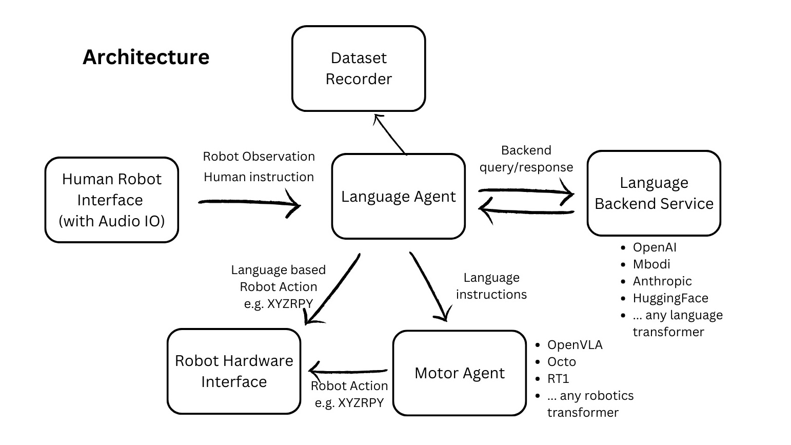

Overview
========

This repository is broken down into 3 main components: **Agents**, **Data**, and **Hardware**. Inspired by the efficiency of the central nervous system, each component is broken down into 3 meta-modalities: **Language**, **Motion**, and **Sense**. Each agent has an ``act`` method that can be overridden and satisfies:

- **Language Agents** always return a string.
- **Motor Agents** always return a ``Motion``.
- **Sensory Agents** always return a ``SensorReading``.

A call to ``act`` can perform local or remote inference, and can be asynchronous or synchronous. Remote execution is performed with `Gradio <https://www.gradio.app/docs/python-client/introduction>`_ or `httpx <https://www.python-httpx.org/>`_ and validation is performed with `Pydantic <https://docs.pydantic.dev/latest/>`_.

Motivation
----------

.. _motivation:

   There is a significant barrier to entry for running SOTA models in robotics.
   It is currently unrealistic to run state-of-the-art AI models on edge devices for responsive, real-time applications. Furthermore,
   the complexity of integrating multiple models across different modalities is a significant barrier to entry for many researchers,
   hobbyists, and developers. This library aims to address these challenges by providing a simple, extensible, and efficient way to
   integrate large models into existing robot stacks.

Goals
-----

.. _goals:

   Facilitate data-collection and sharing among roboticists. This requires reducing much of the complexities involved with setting up inference endpoints, converting between different model formats, and collecting and storing new datasets for future availability.

   We aim to achieve this by:

   #. Providing simple, Python-first abstractions that are modular, extensible and applicable to a wide range of tasks.
   #. Providing endpoints, weights, and interactive Gradio playgrounds for easy access to state-of-the-art models.
   #. Ensuring that this library is observation and action-space agnostic, allowing it to be used with any robot stack.

   Beyond just improved robustness and consistency, this architecture makes asynchronous and remote agent execution exceedingly simple. In particular, we demonstrate how responsive natural language interactions can be achieved in under 30 lines of Python code.

Limitations
-----------

.. _limitations:

Embodied Agents are not yet capable of learning from in-context experience:

- Frameworks for advanced RAG techniques are clumsy at best for OOD embodied applications, however, that may improve.
- The amount of data required for fine-tuning is still prohibitively large and expensive to collect.
- Online RL is still in its infancy and not yet practical for most applications.

Scope
-----

.. _scope:

- This library is intended to be used for research and prototyping.
- This library is still experimental and under active development. Breaking changes may occur although they will be avoided as much as possible. Feel free to report issues!

Features
--------

.. _features:

- Extensible, user-friendly Python SDK with explicit typing and modularity
- Asynchronous and remote thread-safe agent execution for maximal responsiveness and scalability.
- Full compatibility with HuggingFace Spaces, Datasets, Gymnasium Spaces, Ollama, and any OpenAI-compatible API.
- Automatic dataset-recording and optionally uploads dataset to HuggingFace hub.

Endpoints
---------

.. _endpoints:

- `OpenVLA <https://api.mbodi.ai/community-models/>`_
- `Embodied AI Playground <https://api.mbodi.ai/benchmark/>`_
- `3D Object Pose Detection <https://api.mbodi.ai/3d-object-pose-detection/>`_
